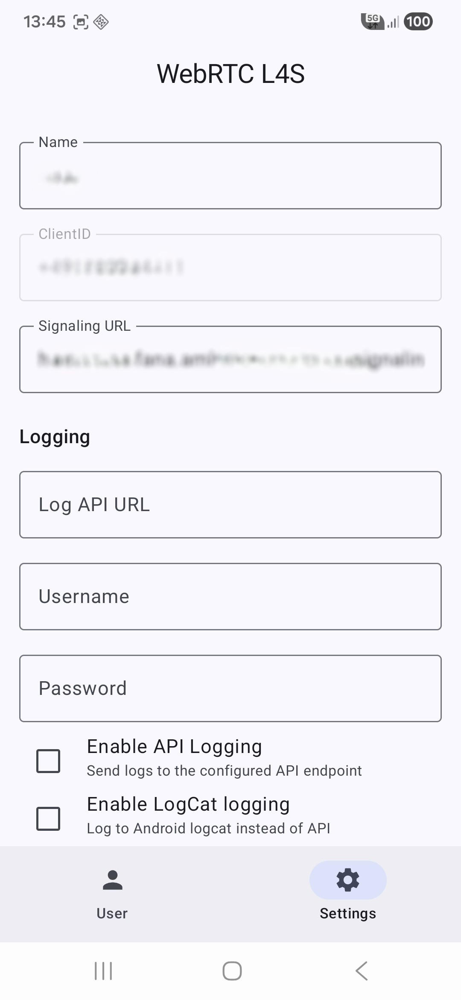
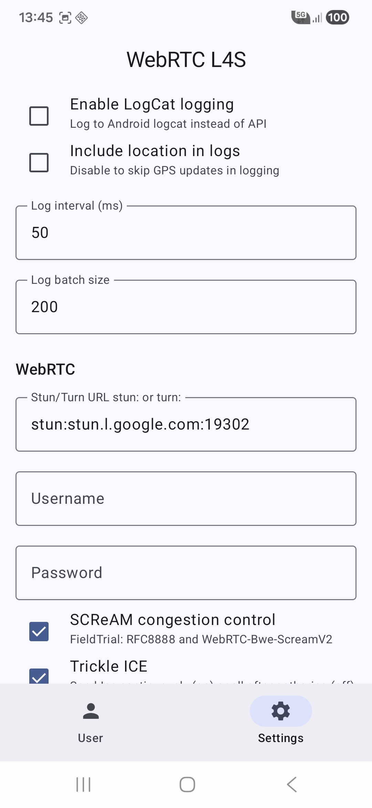
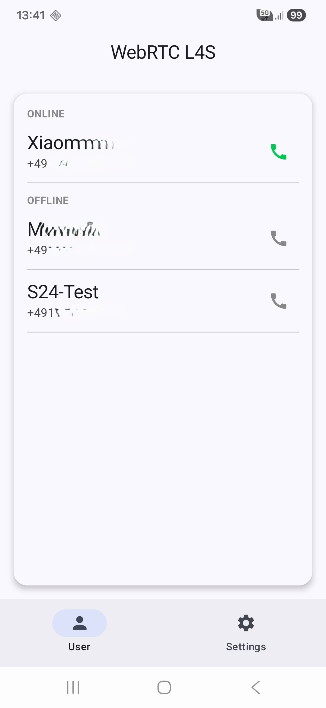
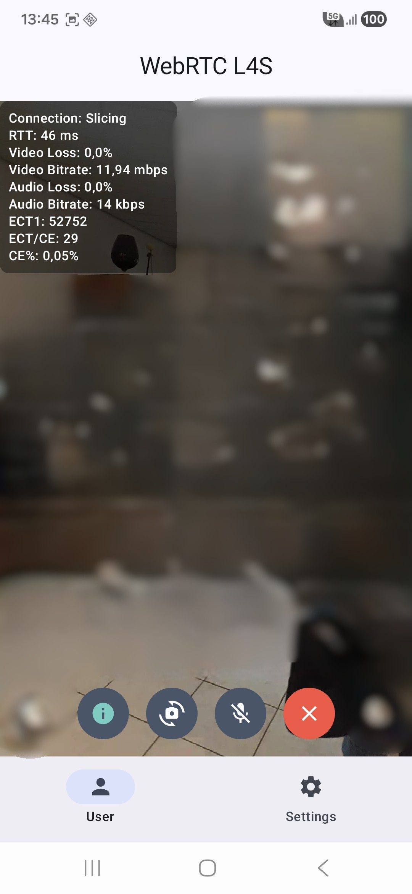

# Android WebRTC sample application for 5G Network Slicing with RFC8888 and SCReAMv2

This application is for testing WebRTC with 5G Network Slicing (PRIORITIZE_LATENCY) and L4S capability in Germany.
It will use [RFC8888](https://datatracker.ietf.org/doc/rfc8888/) and [SCReAMv2](https://github.com/EricssonResearch/scream) field trials in WebRTC.

## Requirements
- Two Smartphones with 5G Network Slicing capabilities e.g. Samsung S24(Pro/Ultra), S25(Pro/Ultra)
- WebRTC build with RFC8888 and SCReAMv2 (current main branch)
  - Included [6263bef](https://webrtc.googlesource.com/src/+/6263befc5add3dfd0baeea211d12d465ee7427d8)
-  Mobile Phone Contract with [5G Plus gaming](https://www.telekom.de/optionsuebersicht/mobilfunk/5gplus-gaming)
- This signaling server [signaling](https://github.com/jworuna/signaling_server)
- Turn server like [coturn](https://github.com/coturn/coturn)
- All App permissions **MUST** be granted
- Application prefers Wifi is for cellular 

## Optional
Some WebAPI with basic auth and POST endpoint that can handle following json format:
```
[{
      "timeStampMs": 1734096000000,
      "rttMs": 28.5,
      "loadkbits": 15420,
      "ecnCePercent": 2.3,
      "packetLossCount": 0,
      "cellId": 123456789,
      "pci": 45,
      "band": 78,
      "streamId": "stream-abc123",
      "sessionName": "TestSession_20251213",
      "isNrSa": 1,
      "dbm": -85,
      "lat": 48.137154,
      "lon": 11.576124
    },
    {
        ...
    }
    ]
```
    
## WebRTC with RFC8888 and SCReAMv2
Use of field trials 
```WebRTC-RFC8888CongestionControlFeedback/Enabled,offer:true/WebRTC-Bwe-ScreamV2/Enabled/```
to set ECT(1) in IP-Header and read ECN-CE markings from IP-Header to control bandwidth of the video streams.

It could happen that ECT(1) is bleached if this is happened WebRTC disables sending of ECT(1).
The prebuild WebRTC, included in libs, fixed this problem through changes to [rtp_transport_controller_send.cc](https://webrtc.googlesource.com/src/+/6263befc5add3dfd0baeea211d12d465ee7427d8/call/rtp_transport_controller_send.cc#772)

from (line 772/773):
```
if (!feedback.transp[.gitignore](.gitignore)ort_supports_ecn ||
        !congestion_controller_support_ecn) {
```
to:
```
if (!congestion_controller_support_ecn) {
```

## Application Settings

- All App permissions **MUST** be granted
- Enabled location service is required

__Common Settings:__
- Name is required
- ClientId is Phone Number and will be filled out automatically
- Signaling URL **IS** required

__Logging Settings:__
- Logging is **NOT** required
- LogCat logging 
  - Prints out every interval with batchsize to Android LogCat
- Include Location
  - log Smartphone location data (only API)
  - Log interval in ms
  - Log batch size
    - Logs e.g. 200 items then logs it to API or LogCat

__WebRTC Settings:__
- Stun/Turn is required (stun:stun.l.google.com:19302)
- Username and Password if necessary e.g. coturn
- "SCReAM congestion control" Use field trials RFC8888 and ScreamV2
- Trickle ICE
- Use Network Slicing to use 5G slice in Germany NET_CAPABILITY_PRIORITIZE_LATENCY
  - 5G "Leaf" Icon upper right shows the successfully request of the slice (Samsung)
  - If selected slice gets requested after switch to "User" tab and on application start 
- Mute Audio on start (default)
- Minimal video bitrate in kbps
- Maximal video bitrate in kbps
- Available Codecs (it could be that not all codecs can change the bitrate on the fly)
  - default lets WebRTC decide which codec is used
- Camera resolution and FPS (default WebRTC decides) 





## App Usage

After application start, online and offline user connected to the same [signaling server](https://github.com/jworuna/signaling_server) will shown in the "User" tab.

- By clicking the green phone symbol the WebRTC connection established immediately (no ringing)
- Call Screen
  - Upper right local video
  - Fullscreen remote video
- Icons from Left to Right
  - RTP inbound stats (showed upper left)
    - Current RTT in milliseconds
    - Current Video packet loss in %
    - Current Video bitrate in mbps
    - Current Audio packet Loss in %
    - Current Audio bitrate in kbps
    - ECT(1) marked packets since start
    - ECN-CE marked packets since start
    - Current ECN-CE in %
  - Toggle between Front/Back Camera
  - Mute/Unmute Audio Stream
  - Hangup call




# Scenarios

- Two slice capable Smartphones

Slice Smartphone(#1) <- (Download ECN-CE marking) Cell <- Internet <- Cell (Upload ECN-CE marking) <- Slice Smartphone(#2)
</br>
Slice Smartphone(#1) -> (Upload ECN-CE marking) Cell -> Internet -> Cell (Download ECN-CE marking) -> Slice Smartphone(#2)

- One slice capable Smartphone

Slice Smartphone(#1) -> (Upload ECN-CE marking) Cell -> Internet -> Cell -> Smartphone(#2)
</br>
Slice Smartphone(#1) <- (Download ECN-CE marking) Cell <- Internet <- Cell <- Smartphone(#2)